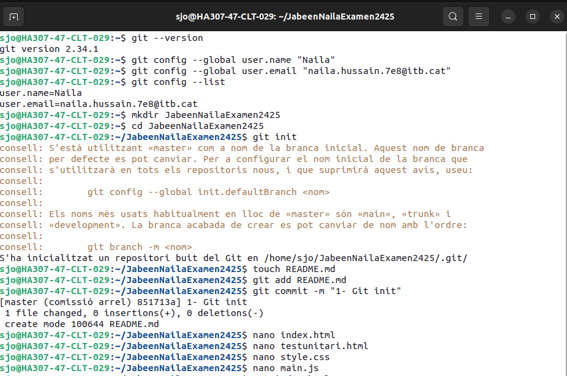
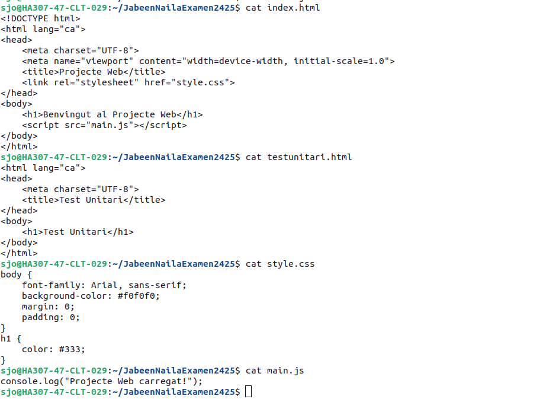
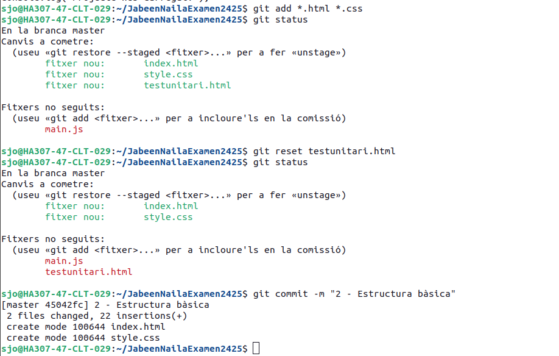
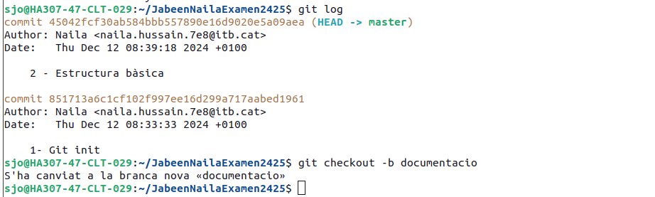
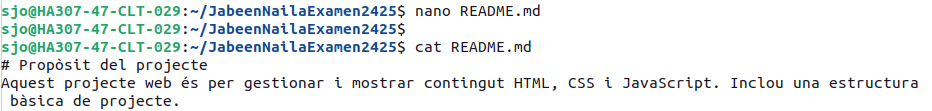
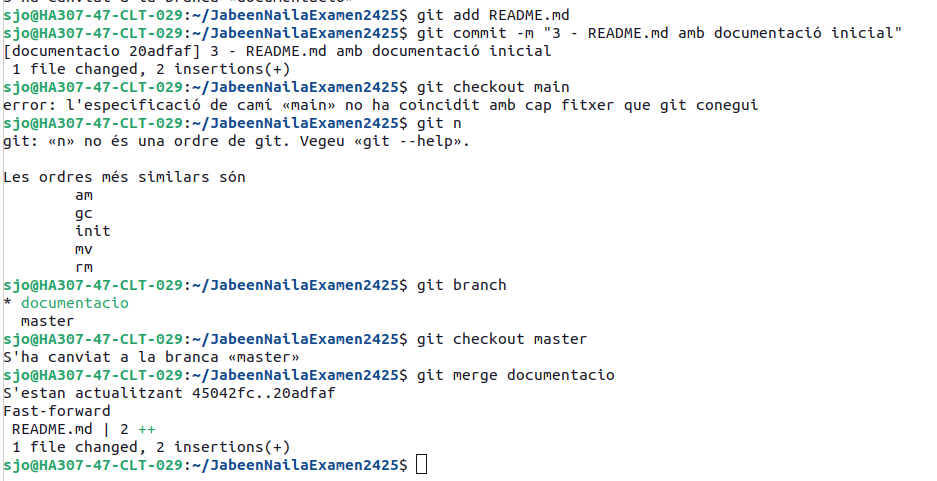
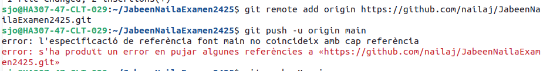
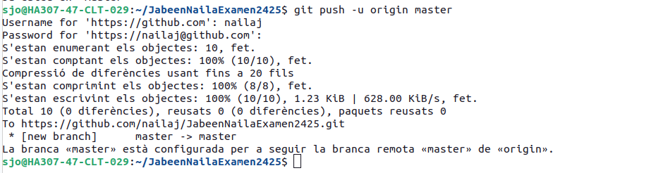

# Examen de Git i Projecte Web

## Propòsit del projecte
Aquest projecte web té com a objectiu gestionar i mostrar contingut utilitzant HTML, CSS i JavaScript. El projecte s'ha creat per aprendre a gestionar el codi font amb Git, treballar amb branques i pujar-lo a un servidor remot com GitHub i Vercel.

---

## Instruccions realitzades

### **1. Configuració inicial i creació de les carpetes necessàries**
Per començar, vaig instal·lar i configurar Git al meu sistema. També vaig crear les carpetes necessàries per al projecte i vaig inicialitzar el repositori local.

 <!-- Imatge que mostra la configuració inicial de Git o la creació de carpetes -->

Aquesta imatge mostra la configuració inicial de Git i la creació de les carpetes necessàries per al projecte.

---

### **2. Configuració de les carpetes**
Vaig crear les carpetes i els fitxers bàsics del projecte, incloent-hi els fitxers HTML, CSS i JavaScript, per establir l'estructura fonamental.

 <!-- Imatge que mostra l'estructura de carpetes -->

Aquesta captura mostra l'estructura de carpetes creada per al projecte.

---

### **3. Primer commit**
Després de crear els fitxers i les carpetes, vaig fer el primer commit per inicialitzar el repositori amb la comanda `git commit -m "Primer commit"`.

 <!-- Imatge que mostra el primer commit al repositori -->

Aquí es pot veure el primer commit realitzat al repositori de Git.

---

### **4. Historial de commits**
Vaig consultar l'historial de commits per verificar els canvis realitzats i assegurar-me que tot estava registrat correctament.

 <!-- Imatge que mostra l'historial de commits -->

Aquesta imatge mostra l'historial de commits amb tots els canvis realitzats fins al moment.

---

### **5. L'arxiu README.md**
Vaig afegir el fitxer `README.md` per documentar el projecte i proporcionar més informació sobre l'objectiu i les passes seguides. Aquest fitxer és essencial per a la documentació del projecte.

 <!-- Imatge que mostra el fitxer README.md -->

Aquí es pot veure el contingut de l'arxiu `README.md` amb la descripció inicial del projecte.

---

### **6. Creació i merge de les branques**
Vaig crear una branca per afegir la documentació del projecte i, un cop finalitzada, vaig fer un merge de la branca `documentacio` amb la branca principal `main`.

 <!-- Imatge que mostra el procés de creació i merge de les branques -->

Aquesta imatge mostra el procés de creació de la branca i la fusió (merge) amb la branca principal.

---

### **7. Conectivitat remota**
Després de configurar GitHub com a repositori remot, vaig establir la connexió amb el meu repositori remot utilitzant la comanda `git remote add origin`.

 <!-- Imatge que mostra la configuració de la connexió remota -->

Aquí es mostra la configuració de la connexió remota amb GitHub per sincronitzar el projecte amb el repositori remot.

---

### **8. Últim pas**
Finalment, vaig pujar els canvis al repositori remot i vaig comprovar que tot estava correctament pujat. També vaig publicar el projecte a Vercel per a que estigués disponible en línia.

 <!-- Imatge que mostra l'últim pas del procés de pujar els canvis -->

Aquesta captura mostra l'últim pas en què vaig pujar els canvis al repositori remot i vaig comprovar que tot estava llest.

---

## Enllaç a Vercel

Per a veure el projecte en línia, fes clic al següent enllaç que redirigeix al projecte publicat a Vercel:

[Visita el projecte a Vercel](https://jabeen-naila-examen2425.vercel.app/)

Aquest enllaç et portarà directament al projecte en viu, publicat a Vercel.

---

Gràcies per llegir la documentació! Si tens alguna pregunta, no dubtis a posar-te en contacte amb mi.
# Propòsit del projecte
Aquest projecte web és per gestionar i mostrar contingut HTML, CSS i JavaScript. Inclou una estructura bàsica de projecte.
### He creat un projecte markdown
**Configuracio Inicial i creacio de les carpetes necessaries.

** Configuracio de les carpetes

** Primer commit

**El historial

**l'arxiu README.md

** Creacio i merge de les branques

** Conectivitat remota

** Ultim pas

** l'Enllaç Vercel
(https://jabeen-naila-examen2425.vercel.app/)

